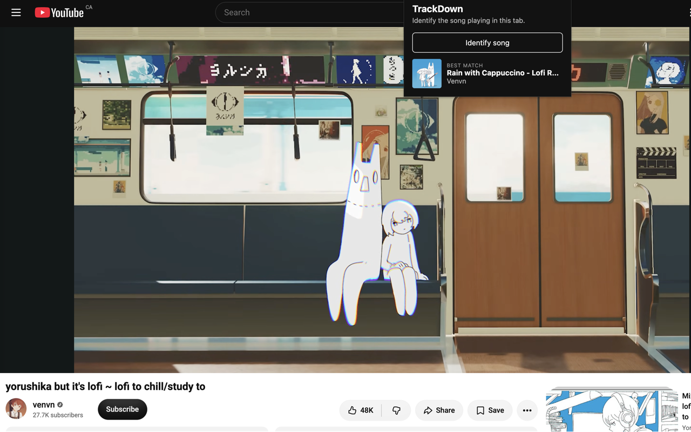

# TrackDown

Identify music playing in a browser tab from a single click.

Holding a phone up to a speaker puts a room in between: noise, speaker distortion, and
whatever the microphone loses on the way. TrackDown takes the audio straight from the tab
instead, so the fingerprinter gets the signal the page actually rendered.

What it does not do is beat the physics of the problem. Fingerprinting is a catalogue
lookup — live versions, covers and remixes are often simply not in it, and quiet background
music underneath speech is the hardest case there is. TrackDown reports a no-match plainly
rather than guessing, and hedges every result it does return.

**Status: v1.0.0, feature-complete, listing revised for resubmission 2026-08-15**
after a rejection under the store's "Inaccurate Description" policy — the listing had
promised background-music identification as its headline case. See `docs/STORE-LISTING.md`.
The API server is deployed and live.



## How it works

```
popup ──click──▶ service worker ──stream ticket──▶ offscreen document
                       │                                  │
                       │                          5s of tab audio
                       ▼                                  ▼
              chrome.storage.session ◀──phase──── Express proxy (Render)
                       │                                  │
                    renders                         ACRCloud + iTunes
```

A click captures five seconds of tab audio, POSTs it to an Express proxy, and the proxy
forwards it to ACRCloud for fingerprinting. The proxy exists for one reason: extension source
is fully public once shipped, so the API credential cannot live there.

### The three contexts

Manifest V3 splits a Chrome extension into isolated contexts that **share no memory**, and
most of this project's design follows from that:

| Context | DOM? | Role |
|---|---|---|
| Popup | yes | Stateless renderer. Destroyed the moment it loses focus. |
| Service worker | **no** | Coordinator. Sleeps after ~30s idle. Sole writer of capture state. |
| Offscreen document | yes | The only place audio can be recorded. |

`MediaRecorder` and `AudioContext` exist only in the offscreen document — the service worker
has no `window`. The restriction runs the other way too, and is easier to miss because the
manifest looks like it grants the permission: **`chrome.runtime` is the only extensions API
an offscreen document has**, so `chrome.storage` is undefined there regardless of what
`permissions` says. That cost a debugging session, and it is why the offscreen document
*reports* phases to the worker rather than writing them.

Commands travel by `chrome.runtime.sendMessage`; capture state travels through
`chrome.storage.session`, which every context reads and subscribes to. That choice makes
"the popup was closed mid-request" stop being a special case — an open popup gets the result
as an `onChanged` event, a reopened one gets it as a read, and both take the same code path.

## Design notes

A few decisions worth pulling out of [`docs/DECISIONS.md`](docs/DECISIONS.md), which records
one entry per non-obvious call:

- **The fingerprinting provider is a config value, not a dependency.** `PROVIDER` selects an
  adapter; provider-specific field names never escape that one file, and routes speak a
  normalized shape only. Switching from AudD to ACRCloud mid-project touched configuration,
  not architecture.
- **Results are hedged unconditionally.** Fingerprinting services have been observed matching
  audio correctly while reporting a mislabeled title from a bad catalogue entry, so nothing is
  presented to the user as certain — even under a provider that returns a confidence score.
- **Cover art refuses to guess.** ACRCloud returns no artwork, so it is filled server-side
  from the iTunes Search API. A candidate needs title *and* artist to match; a near miss
  yields no artwork rather than a stranger's album cover.
- **Two limits, not one.** Per-IP rate limiting bounds a single scraper. A global daily
  circuit breaker bounds the bill when the same volume arrives from a hundred addresses, and
  counts *attempts*, so a failed upstream call still spends budget.
- **"Song not found" is a successful request** — `200 {found: false}`, not a 404. The request
  was understood and answered; the catalogue simply had nothing.
- **The build owns the environment.** `vite.config.js` derives the API origin from the build
  mode and writes it into both the bundle and the manifest's `host_permissions`, and
  `verify-dist.js` fails the build if they disagree. An extension published pointing at
  `localhost` works perfectly on the developer's machine and fails for every user.

## Stack

Chrome Extension (Manifest V3) · React · Vite · Node · Express · ACRCloud · Render

## Local setup

Requires Node ≥ 20.12. The extension has no offline path, so run the server while working
on it.

### Server

```bash
cp .env.example server/.env    # then fill in your provider credentials
cd server
npm install
npm run dev
```

Runs on `http://localhost:3000`. Check it:

```bash
curl localhost:3000/health
curl -F "file=@clip.webm" localhost:3000/api/identify
```

You will need your own credentials for a fingerprinting provider —
[ACRCloud](https://acrcloud.com) by default, or [AudD](https://audd.io) via `PROVIDER=audd`.
Cover art needs none; the iTunes Search API is public and unauthenticated.

### Extension

```bash
cd extension
npm install
npm run dev      # builds against localhost:3000, rebuilding on change
```

Then load it into Chrome:

1. Go to `chrome://extensions`
2. Turn on **Developer mode**
3. **Load unpacked** → select `extension/dist` (the build output, not `extension/` itself)

Chrome does not hot-reload extensions — click the reload icon on the TrackDown card after
each rebuild.

**The two builds target different servers.** `npm run dev` points the extension at
`localhost:3000`; `npm run build` points it at the deployed server and is what you load to
exercise production. Loading the wrong one is not subtle — a dev build with no local server
running says "Can't reach TrackDown".

`npm run build` also runs `npm run verify`, which fails the build if anything the manifest
references by exact path has gone missing. That failure is otherwise silent: the extension
still loads and the service worker simply never runs. Run it by hand after a watch build with
`npm run verify`.

## Structure

```
extension/   Chrome extension — popup (React), service worker, offscreen document
server/      Express API — holds the provider credential, normalizes the response
docs/        Build plan, decision log, privacy policy, store submission pack
scratch/     Throwaway spikes — API probing before committing to a provider
```

## Roadmap

Phases 0–2 are complete. Planned:

- **History** — identifications stored against an install-time UUID, no login. Storing the
  *video* a song was found on is the differentiator: Shazam gives you a song, this gives you
  the song, the source, and the date.
- **Spotify OAuth** — save a match straight to a playlist, via Authorization Code + PKCE,
  since extensions cannot hold a client secret.

## Privacy

TrackDown records only on a click, only ever five seconds, and only tab audio — never the
microphone. Clips are held in memory for the duration of the request and never written to
disk. Full policy: [`docs/PRIVACY.md`](docs/PRIVACY.md).

## License

[MIT](LICENSE). You will need your own fingerprinting provider credentials to run it.
